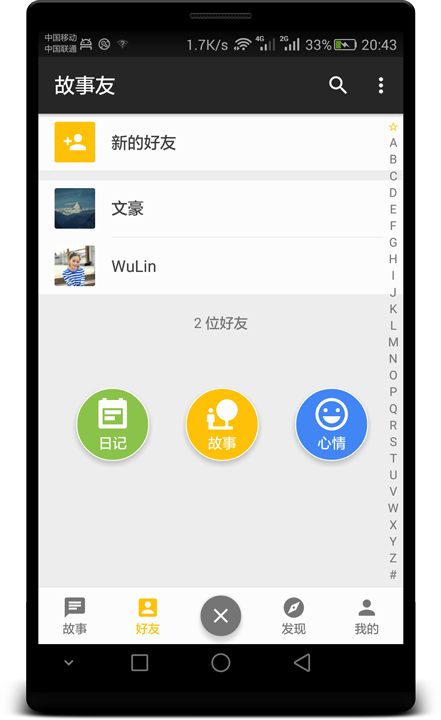
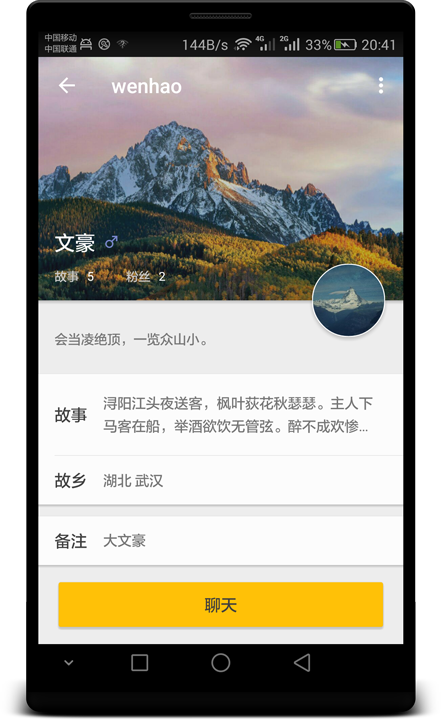
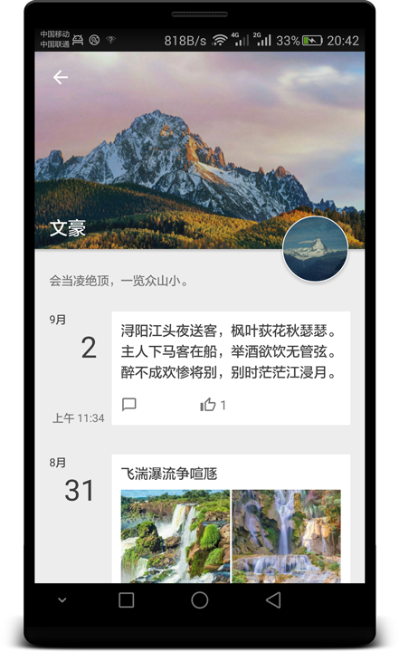
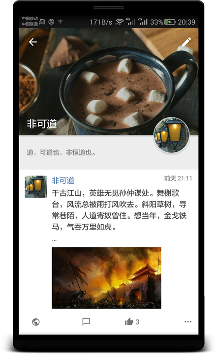
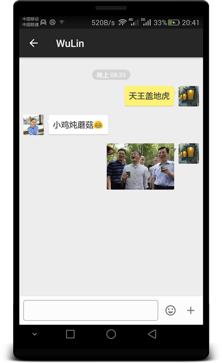
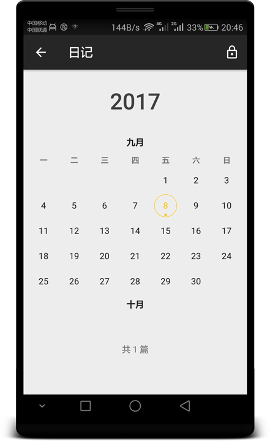
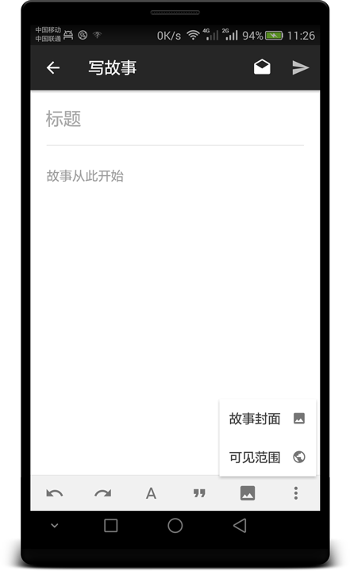
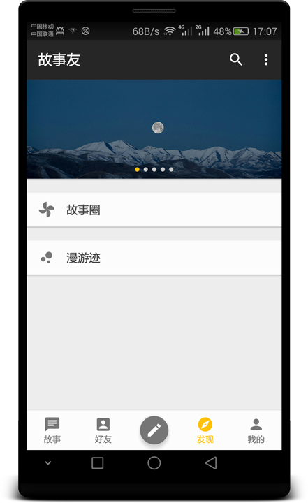
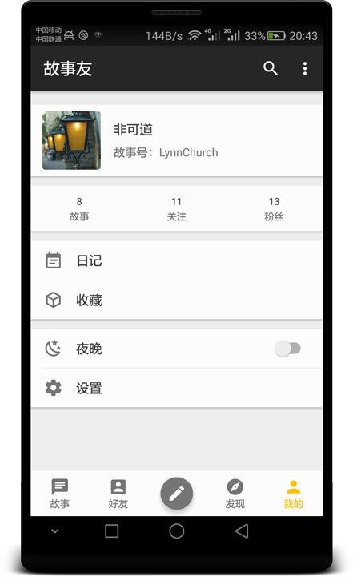

# GuShiYou
一个以分享故事为主的社交平台

## 目录说明

1. DataBackups：此目录备份了一些数据库表的数据

2. GuShiYou_AdminFront：后台管理的前端

3. GuShiYou_AdminServer：后台管理的后端

4. GuShiYou_Android：app安卓端

5. GuShiYou_AppServer：app服务端

6. Screenshots：界面截图

## app部分界面截图

  

 

 

 

